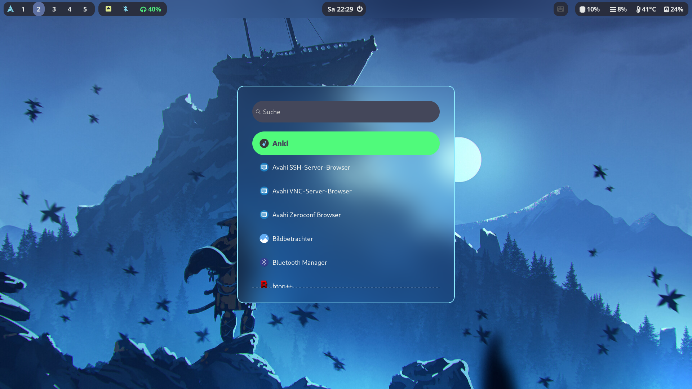

# SamuraiOS

An Artix Linux install script for Samurais 👹 and Ninjas 🥷

This install script is intented to just be used by myself specifically for my PC setup. But if you want you can install it if you can bring it to work on your system.

## Screenshots





## Stage 1

1. Choose keyboard layout
```
loadkeys de
```

2. Partition the disk and create file system

3. Mount partitions

4. Connect to the internet
```
# Using wpa_supplicant to connect to the WiFi
rfkill unblock wifi
ip link set wlan0 up # Replace wlan0 with the interface name. List all with "ip link show"
wpa_passphrase 'SSID' > /etc/wpa_supplicant.conf # Replace SSID with the name of your WiFi and enter the passphrase
wpa_supplicant -B -i wlan0 -c /etc/wpa_supplicant.conf # Replace wlan0 with your interface
dhcpcd wlan0 # Here again replace wlan0 with the name of your interface

# Using connmanctl
connmanctl
connmanctl> scan wifi
connmanctl> services
connmanctl> agent on
connmanctl> connect wifi_237sdf98734sdf987wfsdf98734_managed_psk
connmanctl> quit
```
5. Install go and git on the host
```
pacman -Sy go git
```

6. Execute `go run install.go 1`
*The -y or --yes flag can be used to use all default values at the prompts*
*Use -u or --user combined with the yes flag to only enter the username and password*

7.  Reboot
```
reboot
```

## Stage 3

8.  After logging in execute `sudo dinitctl enable connmand` and reconnect to the internet

9. Execute `go run install.go 3`

10.  Logout

## Stage 4

11. After logging in again execute `go run install.go 4`

12. Base Installation is Done

## Stage 5

13. Do install all applications call `go run install.go 5`

## Dracula Theme License

The MIT License (MIT)

Copyright (c) 2020 Dracula Theme

Permission is hereby granted, free of charge, to any person obtaining a copy
of this software and associated documentation files (the "Software"), to deal
in the Software without restriction, including without limitation the rights
to use, copy, modify, merge, publish, distribute, sublicense, and/or sell
copies of the Software, and to permit persons to whom the Software is
furnished to do so, subject to the following conditions:

The above copyright notice and this permission notice shall be included in all
copies or substantial portions of the Software.

THE SOFTWARE IS PROVIDED "AS IS", WITHOUT WARRANTY OF ANY KIND, EXPRESS OR
IMPLIED, INCLUDING BUT NOT LIMITED TO THE WARRANTIES OF MERCHANTABILITY,
FITNESS FOR A PARTICULAR PURPOSE AND NONINFRINGEMENT. IN NO EVENT SHALL THE
AUTHORS OR COPYRIGHT HOLDERS BE LIABLE FOR ANY CLAIM, DAMAGES OR OTHER
LIABILITY, WHETHER IN AN ACTION OF CONTRACT, TORT OR OTHERWISE, ARISING FROM,
OUT OF OR IN CONNECTION WITH THE SOFTWARE OR THE USE OR OTHER DEALINGS IN THE
SOFTWARE.

## Wallpapers

The Samurai wallpaper used for the main screen was made by Dominik Mayer found on [artstation.com](https://www.artstation.com/artwork/lDG8lY).<br>
The Ghost of Tsushima wallpaper used for the side screen was made by Ömer Tunç found on [alphacoders.com](https://mobile.alphacoders.com/wallpapers/view/897228/Video-Game-Ghost-Of-Tsushima-Phone-Wallpaper)<br>
The Shrine Entrance wallpaper used for the sddm login screen was made by Florent Lebrun found on [artstation.com](https://www.artstation.com/artwork/J9Jzzz)

## Fix Bluetooth

You need to install `bluez-utils-compat`

```
sudo hciconfig hci0 down
sudo rmmod btusb
sudo modprobe btusb
sudo hciconfig hci0 up
```