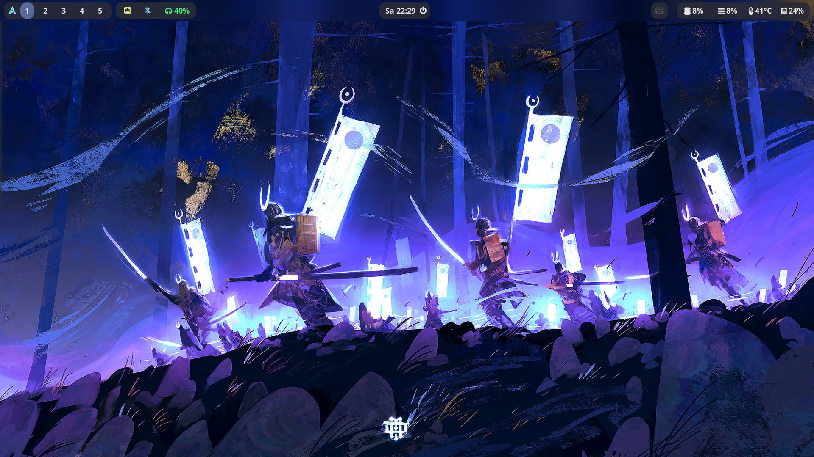

# SamuraiOS

An Arch Linux install script for Samurais 👹 and Ninjas 🥷

This install script is intented to just be used by myself specifically for my PC setup. But if you want you can install it if you can bring it to work on your system.

## Screenshots




## Stage 0

1. Choose keyboard layout
```
loadkeys de
```

2. Partition the disk and create file system
```console
lsblk # Make sure to choose the correct drive
cfdisk /dev/sda # This is just an example!
mkfs.ext4 /dev/sda1
mkswap /dev/sda2 # For swap if necessary
```

3. Mount partitions on `/mnt`
```console
mount /dev/sda1 /mnt
mount /dev/sda3 /mnt/boot # For boot partition on UEFI systems
```

4. Connect to the internet
```console
# Ethernet should just work out of the box. If you have need a wifi connection this is how to do it
# Using wpa_supplicant to connect to the WiFi
rfkill unblock wifi
ip link set wlan0 up # Replace wlan0 with the interface name. List all with "ip link show"
wpa_passphrase 'SSID' > /etc/wpa_supplicant.conf # Replace SSID with the name of your WiFi and enter the passphrase
wpa_supplicant -B -i wlan0 -c /etc/wpa_supplicant.conf # Replace wlan0 with your interface
dhcpcd wlan0 # Here again replace wlan0 with the name of your interface

# Using nmcli with NetworkManager
rkill unblock wifi # Maybe the wifi needs to be unblocked
nmcli dev status # To check the state of things
nmcli radio wifi # To check the sate of wifi
nmcli radio wifi on # Switch the wifi on
nmcli dev wifi list # Scan for nearby access points
nmcli --ask dev wifi connect <SSID> # Connect to the wifi (this needs admin privileges!)
```

5. Download `install0.sh` script and execute it
```
curl -sSL https://raw.githubusercontent.com/Samudevv/SamuraiOS/master/scripts/install0.sh | bash -s # You can add -y|--yes to use all default arguments and -u|--user to just change the user name and password
```

6.  Reboot into the new drive
```
reboot
```

## Setup after reboot

7. Login as `root` with password `root`.

8. Partition and mount the home partition.

9. Add users with `go run install.go user`. The password of the first user will be the root password.

10. Execute `systemctl enable --now sddm.service`

## Stage 2 (applications)

11. To install all applications call `go run install.go apps`

## Dracula Theme License

The MIT License (MIT)

Copyright (c) 2020 Dracula Theme

Permission is hereby granted, free of charge, to any person obtaining a copy
of this software and associated documentation files (the "Software"), to deal
in the Software without restriction, including without limitation the rights
to use, copy, modify, merge, publish, distribute, sublicense, and/or sell
copies of the Software, and to permit persons to whom the Software is
furnished to do so, subject to the following conditions:

The above copyright notice and this permission notice shall be included in all
copies or substantial portions of the Software.

THE SOFTWARE IS PROVIDED "AS IS", WITHOUT WARRANTY OF ANY KIND, EXPRESS OR
IMPLIED, INCLUDING BUT NOT LIMITED TO THE WARRANTIES OF MERCHANTABILITY,
FITNESS FOR A PARTICULAR PURPOSE AND NONINFRINGEMENT. IN NO EVENT SHALL THE
AUTHORS OR COPYRIGHT HOLDERS BE LIABLE FOR ANY CLAIM, DAMAGES OR OTHER
LIABILITY, WHETHER IN AN ACTION OF CONTRACT, TORT OR OTHERWISE, ARISING FROM,
OUT OF OR IN CONNECTION WITH THE SOFTWARE OR THE USE OR OTHER DEALINGS IN THE
SOFTWARE.

## Wallpapers

The Shrine Entrance wallpaper used for the sddm login screen was made by Florent Lebrun found on [artstation.com](https://www.artstation.com/artwork/J9Jzzz)
The Dark Samurai wallpaper used for the main screen was made by Dominik Mayer found on [artstation.com](https://www.artstation.com/artwork/lDG8lY).<br>
The Dark Ghost of Tsushima wallpaper used for the side screen was made by Ömer Tunç found on [alphacoders.com](https://mobile.alphacoders.com/wallpapers/view/897228/Video-Game-Ghost-Of-Tsushima-Phone-Wallpaper)<br>
The Light Main Wallpaper was made by jin'cke found on [pinterest.com](https://ar.pinterest.com/pin/99431104299213665/)
The Light Side Wallpaper was found on [pinterest.com](https://www.pinterest.at/pin/140806221507727/)

## Fix Bluetooth

You may need to call `modprobe btusb` to make bluetooth work. And maybe even to set up a systemd service for that.

You need to install `bluez-utils-compat`

```
sudo hciconfig hci0 down
sudo rmmod btusb
sudo modprobe btusb
sudo hciconfig hci0 up
```
